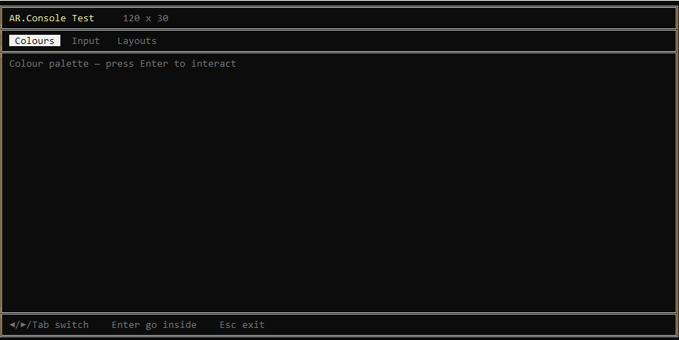

# AR.Console

A lightweight, cross-platform TUI (Text User Interface) framework for Delphi.

**Windows + Linux + macOS** from a single codebase.



## Features

- **Cross-platform** -- Windows (VT100 via SetConsoleMode), Linux and macOS (termios raw mode)
- **Unicode box drawing** -- single-line and double-line frame characters
- **16-colour palette** -- standard + bright ANSI foreground colours
- **Extended key input** -- arrow keys, F-keys, Home/End/PgUp/PgDn with full CSI parsing on POSIX
- **Mouse support** -- click detection, wheel scrolling, and cursor shapes (`crDefault`, `crPointer`, `crBusy`) via SGR mouse protocol
- **Layout system** -- abstract `TConsoleLayout` base with pluggable concrete layouts
- **Layout registry** -- `TLayoutRegistry` for enumerating and instantiating registered layouts, each with a self-rendering preview
- **Tab bar** -- `TTabBar` with arrow/Tab navigation, focus state (reverse-video / underline), Enter activation, and clickable tabs
- **Button items** -- `TButtonItem` with `OnClick` handlers, embeddable in the tab bar alongside tabs
- **List box** -- `TListBox` with keyboard/mouse navigation, scrolling, and optional multi-column display
- **Clickable item base** -- `TClickableItem` shared ancestor for bar items, list-box items, and custom clickable elements
- **Focus model** -- tab-bar vs content focus with key bubbling via `ReadLine(out AExitKey)`
- **Layout helpers** -- `PrintContent`, `ShowStatus`, `PromptInput` for working relative to the content area
- **Menu system** -- `ShowMenu` draws a framed option list and waits for a keypress

## Architecture

```
Library/
  AR.Console.Base.pas       -- TConsoleBase (abstract), TConsoleLayout (abstract),
                               enums (TConsoleColor, TBoxStyle, TConsoleCursor,
                               TMouseButton, TMouseEvent), key codes, box-drawing
                               constants, ANSI output
  AR.Console.Layouts.pas    -- TClickableItem, TBarItem / TTabItem / TButtonItem,
                               TFrameLayout, TSingleFrameLayout, TDoubleFrameLayout,
                               TTabBar, TListBox, TTabbedLayout, TLayoutRegistry
  AR.Console.Windows.pas    -- TWindowsConsole : TConsoleBase
  AR.Console.POSIX.pas      -- TPosixConsole : TConsoleBase
  AR.Console.pas            -- TConsole = platform alias + Con singleton

Demo/
  ConsoleTest.dpr           -- Tabbed demo app (Colours, Input, Layouts)
```

Platform selection happens at compile time:

```pascal
uses AR.Console, AR.Console.Base, AR.Console.Layouts;

// TConsole is TWindowsConsole on Windows, TPosixConsole on POSIX.
// Con is a lazily-initialised global singleton.
```

## Quick start

```pascal
uses
  AR.Console.Base, AR.Console.Layouts, AR.Console;

begin
  // Con auto-initialises on first access
  Con.Clear;
  Con.SetColor(ccBrightYellow);
  Con.PrintAt(3, 2, 'Hello from AR.Console!');
  Con.ResetColor;
  Con.ReadKey;
end.
```

### Using a layout

```pascal
var
  Layout: TDoubleFrameLayout;
begin
  Layout := TDoubleFrameLayout.Create(Con);
  Con.SetLayout(Layout);   // Draws the frame immediately

  Con.PrintContent(1, 1, 'Title goes here');
  Con.ShowStatus('Press any key...');
  Con.ReadKey;
end.
```

### Using the tab bar

```pascal
var
  Layout: TTabbedLayout;
begin
  Layout := TTabbedLayout.Create(Con, bsDouble);
  Layout.TabBar.SetTabs(['Tab 1', 'Tab 2', 'Tab 3']);
  Con.SetLayout(Layout);

  // Left/Right/Tab to cycle, Enter to activate
  // Click a tab with the mouse to switch directly
  // See Demo/ConsoleTest.dpr for a complete focus-model example.
end.
```

### Mouse support

```pascal
begin
  Con.EnableMouse;
  Con.SetMouseCursor(crPointer);

  repeat
    Key := Con.ReadKeyCode;
    if Key = KEY_MOUSE then
    begin
      Evt := Con.MouseEvent;
      if (Evt.Button = mbLeft) and Evt.Pressed then
        Con.PrintAt(1, 1, Format('Click at %d,%d', [Evt.Col, Evt.Row]));
    end;
  until Key = KEY_ESCAPE;

  Con.DisableMouse;
end.
```

### Adding a button to the tab bar

```pascal
var
  Layout: TTabbedLayout;
begin
  Layout := TTabbedLayout.Create(Con, bsDouble);
  Layout.TabBar.SetTabs(['Tab 1', 'Tab 2']);
  Layout.TabBar.AddButton('[Quit]',
    procedure begin ShouldExit := True; end);
  Con.SetLayout(Layout);
end.
```

### Using a list box

```pascal
var
  LB: TListBox;
begin
  LB := TListBox.Create(Con);
  LB.SetBounds(3, 6, 30, 10);       // left, top, width, height
  LB.Columns := 1;                   // set to 2+ for multi-column
  LB.AddItem('Option A');
  LB.AddItem('Option B');
  LB.AddItem('Option C', procedure begin ShowMessage('C!'); end);
  LB.Draw;

  // In your key loop:
  //   if LB.HandleKey(KeyCode) then
  //     ... selection changed or Enter fired OnClick ...
  //
  // For mouse clicks:
  //   Hit := LB.HitTest(MouseEvt.Col, MouseEvt.Row);
  //   if Hit >= 0 then begin LB.SelectedIndex := Hit; LB.Draw; end;
end.
```

## Extending

**Add a new layout:** subclass `TConsoleLayout`, implement `DrawFrame`, `DrawPreview`, `GetContentArea`, `GetInputRow`, `GetInputCol`, `GetTitleArea`, and register it.

**Add a custom clickable item:** subclass `TClickableItem` for list boxes, or subclass `TBarItem` (which adds `Draw` and `DisplayWidth`) for the tab bar.

**Register a layout:**

```pascal
TLayoutRegistry.Register('My Layout', TMyLayout);
```

It will automatically appear in any layout browser that enumerates the registry.

## Requirements

- Delphi 10.4 Sydney or later (inline variable declarations)
- Windows 10+ (for VT100 support) or any POSIX terminal

## Author

Andrea Raimondi

## License

MIT
